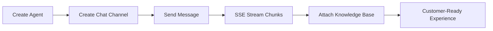

# AI Sandbox SDK for TypeScript


## UX-First Value Cards

| Quick Integration | Real-Time Experience | Reliability by Default |
| --- | --- | --- |
| 60-second quick start and minimal setup friction | SSE chunk streaming for responsive chat UI | Timeout + retry controls for production traffic |

## Visual Integration Flow



## 60-Second Quick Start

```ts
import { AiSandboxClient } from "@egroupai/ai-sandbox-sdk-typescript";

const client = new AiSandboxClient({
  baseUrl: process.env.AI_SANDBOX_BASE_URL ?? "https://www.egroupai.com",
  apiKey: process.env.AI_SANDBOX_API_KEY ?? "",
});

const agent = await client.createAgent({
  agentDisplayName: "Support Agent",
  agentDescription: "Handles customer inquiries",
});
const agentPayload =
  agent && typeof agent === "object"
    ? (agent as { payload?: Record<string, unknown> }).payload
    : undefined;
const agentId = Number(agentPayload?.agentId ?? 0);

const channel = await client.createChatChannel(agentId, {
  title: "Web Chat",
  visitorId: "visitor-001",
});
const channelPayload =
  channel && typeof channel === "object"
    ? (channel as { payload?: Record<string, unknown> }).payload
    : undefined;
const channelId = String(channelPayload?.channelId ?? "");

for await (const chunk of client.sendChatStream(agentId, {
  channelId,
  message: "What is the return policy?",
  stream: true,
})) {
  console.log(chunk);
}
```

## Installation

```bash
npm install @egroupai/ai-sandbox-sdk-typescript
```

## Snapshot

| Metric | Value |
| --- | --- |
| API Coverage | 11 operations (Agent / Chat / Knowledge Base) |
| Stream Mode | `text/event-stream` with `[DONE]` handling |
| Retry Safety | 429/5xx auto-retry for GET/HEAD + capped exponential backoff |
| Error Surface | `ApiError` with status/body/traceId |
| Validation | Production-host integration verified |

## Links

- [Official System Integration Docs](https://www.egroupai.com/ai-sandbox/system-integration)
- [30-Day Optimization Plan](docs/30D_OPTIMIZATION_PLAN.md)
- [Integration Guide](docs/INTEGRATION.md)
- [Quickstart Example](examples/quickstart.ts)
- [Repository](https://github.com/eGroupAI/ai-sandbox-sdk-typescript)
